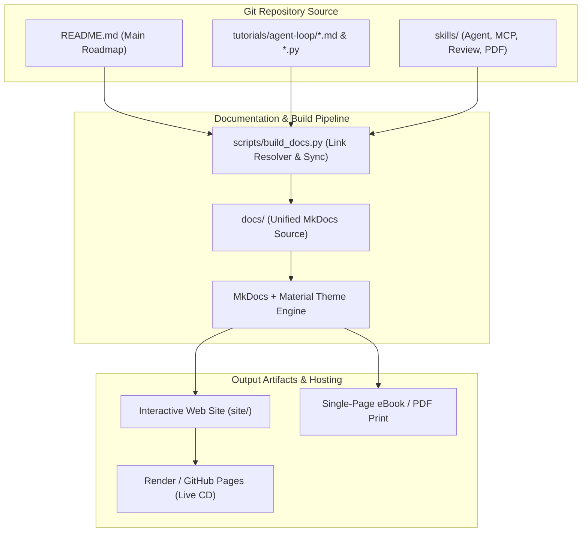

# Agentic Engineering Handbook — Architecture & System Design

## 1. System Overview

The **Agentic Engineering Handbook** system is structured into two core layers:
1. **Core Agent Systems & Tutorials Layer**: Contains hands-on implementations of LLM agent loops (`v0` to `v4`), skill suites, MCP integrations, and architectural patterns.
2. **Interactive Publishing & Documentation Pipeline**: Converts raw Markdown guides and code tutorials into a production-grade interactive documentation site and printable PDF eBook via MkDocs Material and Render static site hosting.

---

## 2. System Architecture Diagram

---

## 3. Component Details

### 3.1 Agent Loop Evolution (`tutorials/agent-loop/`)
| Version | Component Name | Description | Key Modules |
|:---|:---|:---|:---|
| **v0** | Bash Agent Loop | Minimal zero-dependency bash execution loop | `v0_bash_agent.py` |
| **v1** | Model as Agent | LLM tool selection and dynamic invocation | `v1_basic_agent.py` |
| **v2** | Structured Planning | Plan-and-execute loop with todo list management | `v2_todo_agent.py` |
| **v3** | Subagent Orchestration | Task decomposition and parallel subagent spawning | `v3_subagent.py` |
| **v4** | Skills System | Modular skill injection, dynamic tool loading | `v4_skills_agent.py` |

### 3.2 Documentation Pipeline (`scripts/`)
- `scripts/build_docs.py`: Resolves relative Markdown links, copies root files to `docs/`, and generates navigation indexes.
- `scripts/start_docs.py`: Provides 1-click local server binding (`0.0.0.0:8000`) for cross-device & mobile viewing on local Wi-Fi.
- `mkdocs.yml`: Production theme config supporting light/dark themes, code copying, search auto-complete, and `mkdocs-print-site-plugin`.

---

## 4. Deployment Pipeline (Render / GitHub Pages)

- **Infrastructure**: Static Site Hosting on Render.com (`render.yaml`).
- **Build Command**: `pip install -r requirements.txt && python scripts/build_docs.py && mkdocs build`
- **Publish Path**: `./site`
