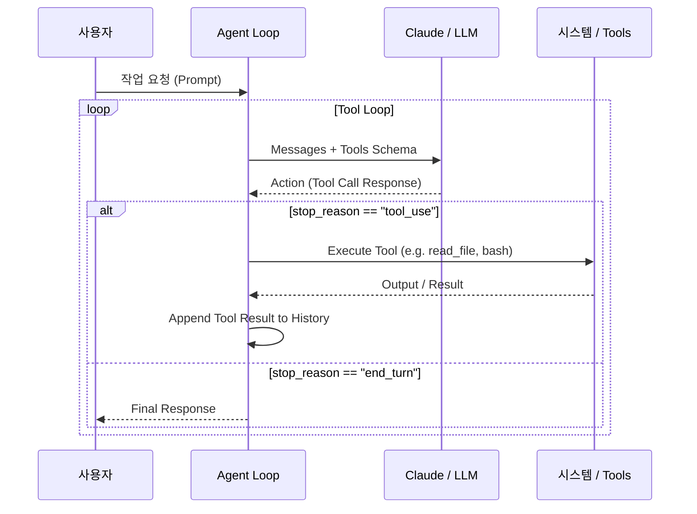

# v1: 에이전트로서의 모델 (Model as Agent)

**기본 툴 사용 루프와 동적 도구 호출 메커니즘**

v1 단계에서는 LLM이 단순 텍스트 생성을 넘어, 스스로 판단하여 내장된 도구(File Operations, Bash execution 등)를 선택하고 실행한 후 결과를 관찰(Observe)하는 기본 에이전트 루프를 만듭니다.

---

## 핵심 개념 (Core Concepts)

1. **도구 정의 (Tool Definition)**: JSON Schema 형태로 에이전트가 수행 가능한 도구 목록을 모델에 전달합니다.
2. **이행 제어 (Tool Use Decision)**: 모델이 `stop_reason == "tool_use"`를 반환할 때, 에이전트 코드가 이를 수신하고 해당 함수를 실행합니다.
3. **관찰 피드백 (Observation Feedback)**: 실행 결과를 `tool_result` 타입으로 히스토리에 누적시켜 모델이 다음 행동을 결정하게 합니다.

---

## 에이전트 실행 루프 구조

---

## 주요 구현 요약 (`v1_basic_agent.py`)

- `read_file`, `write_file`, `edit_file`, `bash` 등의 세분화된 전용 도구 구현
- 대화 히스토리 추적 및 오류 예외 처리
- 인라인 코드 실행 결과를 관찰 피드백으로 루프 재진입

[← 메인 로드맵으로 돌아가기](../../index.md) | [다음: v2 구조화된 계획 수립 →](./v2-structured-planning.md)
