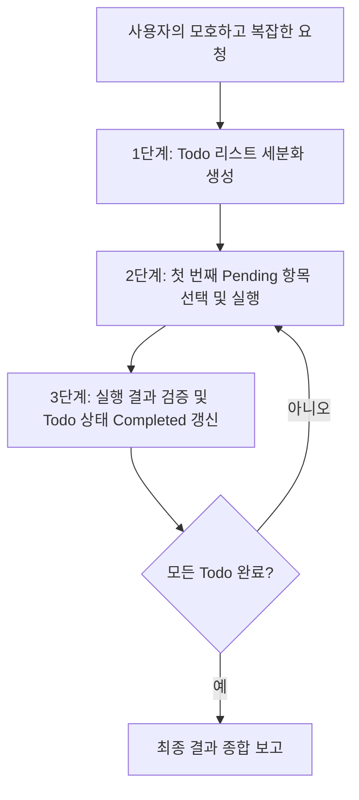

# v2: 구조화된 계획 수립 (Structured Planning)

**To-Do 리스트 관리와 에이전트 목표 이탈(Drift) 방지**

작업이 복잡해지고 대화 길이가 길어질수록 에이전트는 원래 목표를 잊거나 엉뚱한 방향으로 탐색을 계속하는 **목표 이탈(Goal Drift)** 현상을 겪게 됩니다.

v2 단계에서는 명시적인 **Todo 도구 및 계획 수립(Plan-and-Execute)** 메커니즘을 추가하여 복잡한 작업을 안정적으로 완수하도록 설계합니다.

---

## 핵심 메커니즘 (Key Mechanisms)

1. **Todo 도구 도입**:
   - `create_todo`: 작업 세부 목표 및 상태 관리
   - `update_todo`: 완료(completed), 진행중(in_progress), 보류(pending) 상태 갱신
2. **상태 가시성 유지**:
   - 매 루프마다 현재 Todo 리스트의 상태를 시스템 프롬프트 또는 유저 피드백 상단에 재주입하여 컨텍스트 내 선명도를 유지합니다.

---

## 구조화된 처리 흐름

---

## 효과 및 검증

- **목표 이탈 방지**: 긴 태스크 수행 시 중간 단계 점검으로 신뢰성 대폭 상승
- **투명한 진행률 시각화**: 사용자가 에이전트의 현재 작업 단계를 명확히 파악 가능

[← 이전: v1 에이전트 모델](./v1-model-as-agent.md) | [← 메인 로드맵으로 돌아가기](../../index.md) | [다음: v3 서브에이전트 메커니즘 →](./v3-subagent-mechanism.md)
