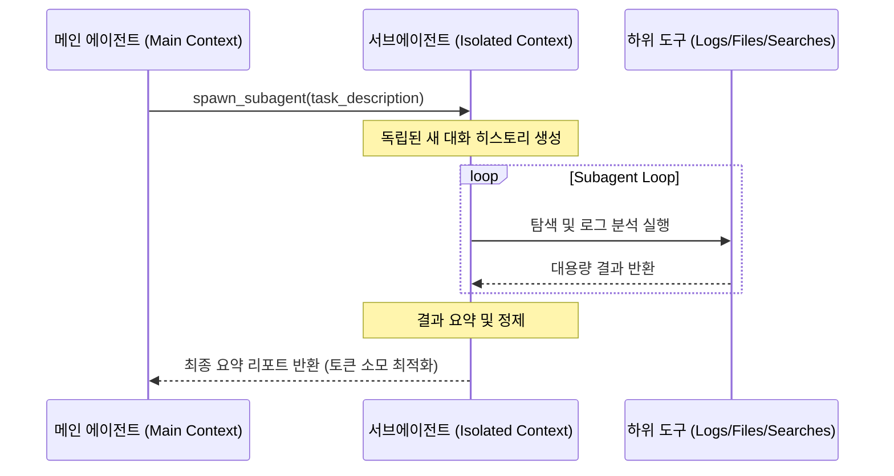

# v3: 서브에이전트 메커니즘 (Subagent Mechanism)

**독립된 컨텍스트 스코프와 자율 서브에이전트 위임**

단일 메인 컨텍스트 윈도우에 대량의 로그나 검색 결과를 모두 채우면 **컨텍스트 오염(Context Poisoning)** 및 비용 폭증이 발생합니다.

v3 메커니즘은 주 에이전트(Main Agent)가 하위 탐색 작업을 담당하는 **서브에이전트(Subagent)**를 생성하고, 격리된 컨텍스트에서 탐색을 완료한 후 핵심 요약 결과만 수신하도록 합니다.

---

## 핵심 구조 및 동작 원리

---

## 주요 이점 (Benefits)

1. **메인 컨텍스트 보호**: 대용량 파티션 검색이나 빌드 로그가 메인 대화 윈도우를 오염시키지 않음
2. **독립된 목표 집중**: 서브에이전트는 좁고 명확한 한 가지 목표에만 집중하여 정밀도 향상
3. **병렬 탐색 확장성**: 여러 분야의 서브에이전트를 동시 구동 가능

[← 이전: v2 구조화된 계획 수립](./v2-structured-planning.md) | [← 메인 로드맵으로 돌아가기](../../index.md) | [다음: v4 스킬 메커니즘 →](./v4-skills-mechanism.md)
